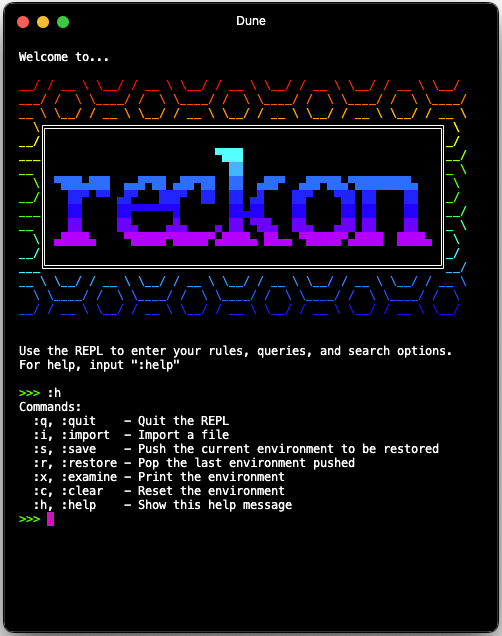
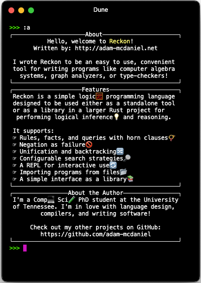
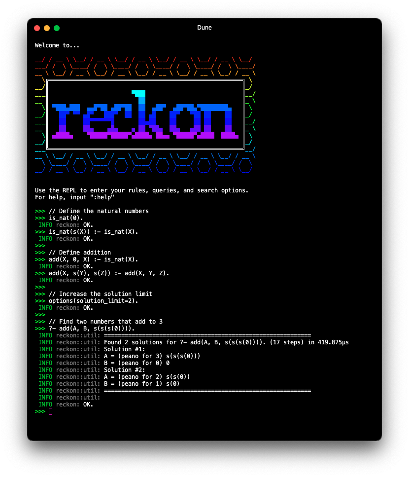
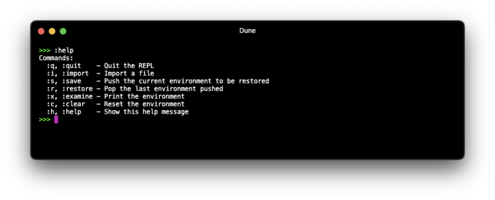
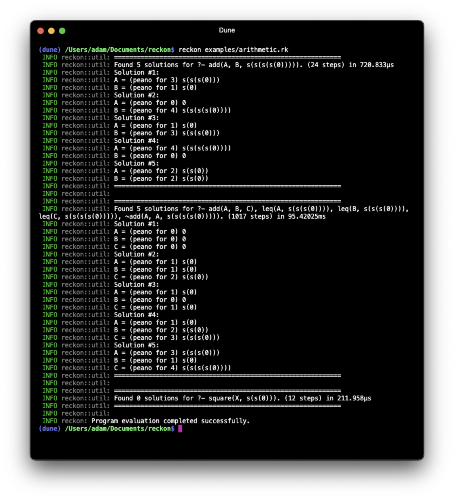
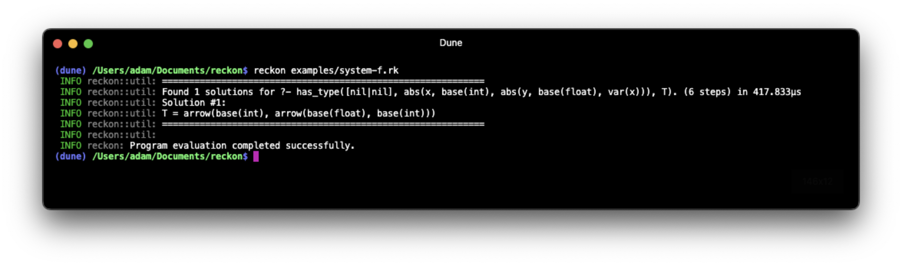

# reckon

<div align="center">
  <h1>🧮💡<b>The Reckon Programming Language</b>💭📐</h1>
  <p>
    <strong>A reasonable language for reasoning tasks!</strong>
  </p>
  <p float="left">
    
    
  </p>
</div>

## Table of Contents

- [About](#about)
- [Getting Started](#getting-started)
  - [Using Reckon as a Library](#using-reckon-as-a-library)
- [Examples](#examples)
  - [Arithmetic](#arithmetic)
  - [System F](#system-f)
- [Documentation](#documentation)
- [License](#license)
- [About the Author](#about-the-author)

## About

Reckon is a programming language designed for reasoning tasks, proof checking, and logical inferencing. Its syntax is a variant of Prolog, so it's easy to learn and use if you're already familiar with logic programming or propositional logic.

The language is still in its early stages of development, so there are many features that are not yet implemented. However, the core functionality is there, and you can already write and run simple programs in Reckon.

## Getting Started

To get started with Reckon, you'll need to have the following installed on your machine:
- [The Rust Programming Language](https:%www.rust-lang.org/tools/install)
- [Cargo](https:%doc.rust-lang.org/cargo/getting-started/installation.html)

Once you have Rust and Cargo installed, you can clone this repository and install the interpreter with Cargo:

```bash
$ cd ~/Downloads
$ git clone https:%github.com/adam-mcdaniel/reckon.git
$ cd reckon
$ cargo install --path .
```

Now you should be able to run the Reckon interpreter from the command line:

```bash
$ reckon
```

This will start the Reckon REPL, where you can begin to enter your rules and queries!



For more information on how to use the REPL commands, type `:help` in the REPL.



### Using Reckon as a Library

Although Reckon is a CLI tool, I mainly designed it to be used as a library to perform reasoning tasks within code.

To use Reckon as a library, add the following to your `Cargo.toml` file:

```toml
[dependencies]
reckon = { git = "https://github.com/adam-mcdaniel/reckon" }
```

Then, you can use Reckon in your Rust code like the example below.
If you know how to write Reckon code, it's very easy to integrate it into your Rust code.

The following example demonstrates how we can use the `prove_true` function to find a single solution to a query using the Reckon library.

#### Proving and Disproving Queries

```rust
use reckon::*;

fn main() {
    // Define some rules to use for inference
    let rules: Vec<Rule> = vec![
        "is_nat(s(X)) :- is_nat(X).".parse().unwrap(),
        "is_nat(0).".parse().unwrap(),
        "add(X, s(Y), s(Z)) :- add(X, Y, Z).".parse().unwrap(),
        "add(X, 0, X) :- is_nat(X).".parse().unwrap(),
    ];

    // Create a new environment with the rules
    let mut env = Env::<DefaultSolver>::new(&rules);

    // Define a query to find two numbers that add to 4
    let query: Query = "?- add(A, B, s(s(s(s(0))))).".parse().unwrap();

    // You can use the `prove_true` method to find a single solution,
    // or the `prove_false` method to check if the query is false.
    match env.prove_true(&query) {
        Ok(solution) => {
            println!("Found proof: ");
            println!("{}", solution);
        }
        Err(e) => eprintln!("Unproven terms: {:?}", e)
    }
}
```

This code will output the following:

```bash
Found proof: 
Solution for query: ?- add(A, B, s(s(s(s(0))))).
Final query: ?- .
Variable bindings:
A = 0
B = s(s(s(s(0))))
```

#### Finding Multiple Solutions

We can also use the `find_solutions` function to find multiple solutions to a query.
This allows us to exhaustively search for all possible solutions to a query,
until the depth fails or the solution limit is reached. You can optionally set a step limit in the search configuration, if you want to guarantee an answer within a certain amount of time.

```rust
use reckon::*;

fn main() {
    // Define some rules to use for inference
    let rules: Vec<Rule> = vec![
        "is_nat(s(X)) :- is_nat(X).".parse().unwrap(),
        "is_nat(0).".parse().unwrap(),
        "add(X, s(Y), s(Z)) :- add(X, Y, Z).".parse().unwrap(),
        "add(X, 0, X) :- is_nat(X).".parse().unwrap(),
    ];

    // Create a new environment with the rules
    let mut env = Env::<DefaultSolver>::new(&rules)
        // Set the solution limit to 4 for the following queries
        .with_search_config(SearchConfig::default().with_solution_limit(4));


    // Define a query to find two numbers that add to 4
    let query: Query = "?- add(A, B, s(s(s(s(0))))).".parse().unwrap();

    // Alternatively, find multiple solutions to the query
    match env.find_solutions(&query) {
        Ok(solutions) => {
            // For each solution found, print the variable bindings
            for (i, solution) in solutions.iter().enumerate() {
                println!("Solution #{}: ", i + 1);
                for (var, binding) in solution {
                    println!("{} = {}", var, binding);
                }
            }
        }
        // Unsolved goals
        Err(e) => eprintln!("Unproven terms: {:?}", e)
    }
}
```

This code will output the following:

```bash
Solution #1: 
A = 0
B = s(s(s(s(0))))
Solution #2: 
A = s(s(0))
B = s(s(0))
Solution #3: 
A = s(s(s(0)))
B = s(0)
Solution #4: 
A = s(0)
B = s(s(s(0)))
```

## Examples

The [`examples`](examples) directory contains a few example programs that you can run in 
the Reckon interpreter.

The subsection below shows some of these examples.

### Arithmetic

Here's an example Reckon program that does some more complex arithmetic:

```prolog
% Define the natural numbers
is_nat(s(X)) :- is_nat(X).
is_nat(0).

% Define addition of natural numbers
add(X, 0, X) :- is_nat(X).
add(X, s(Y), s(Z)) :- add(X, Y, Z).

% Define multiplication of natural numbers
mul(X, s(Y), Z) :- mul(X, Y, W), add(X, W, Z).
mul(X, 0, 0) :- is_nat(X).

% Define less-than-or-equal-to relation on natural numbers
leq(0, X) :- is_nat(X).
leq(s(X), s(Y)) :- leq(X, Y).

% Define greater-than-or-equal-to relation on natural numbers
geq(X, Y) :- leq(Y, X).

% Define equality relation on natural numbers
eq(X, Y) :- leq(X, Y), leq(Y, X).
neq(X, Y) :- ~eq(X, Y).

% Define less-than relation on natural numbers
lt(X, Y) :- leq(X, Y), ~eq(X, Y).
% Define greater-than relation on natural numbers
gt(X, Y) :- geq(X, Y), ~eq(X, Y).

% Define the square relation, Y is the square of X if Y = X^2
square(X, Y) :- mul(X, X, Y).

% Find two numbers whose sum is 4
?- add(A, B, s(s(s(s(0))))).

% Find three numbers A, B, C such that A + B = C and A <= 3, B <= 3, C <= 4, and A + A != 4
?- ~add(A, A, s(s(s(s(0))))), add(A, B, C), leq(A, s(s(s(0)))), leq(B, s(s(s(0)))), leq(C, s(s(s(s(0))))).

% Set the solution limit to 1 for the following queries
options(solution_limit=1).

% Find a natural number X such that X^2 = 2 (no solution)
?- square(X, s(s(0))). % false
```

#### Output

To run this example ([`arithmetic.rk`](examples/arithmetic.rk)), use the `reckon` command line program with the file as an argument:

```bash
$ reckon examples/arithmetic.rk
```

This yields the following output:



### System F

Below is an example Reckon program that implements some rules for [System F](https://en.wikipedia.org/wiki/System_F).

System F is a typed lambda calculus that extends the simply typed lambda calculus with universal quantification. It is a powerful language for reasoning about polymorphic functions and types. It's used in many functional programming languages, such as Haskell.

It's also pretty complex, so this example is a bit more involved than the previous one.

```prolog
options(
    depth_limit=500,
    width_limit=5,
    traversal="breadth_first",
    pruning=false,
    require_rule_head_match=true,
    reduce_query=false,
    solution_limit=1,
    clean_memoization=true
).

term(var(X)) :- atom(X).

atom(X).

% Lambda abstraction
term(abs(X, T, Body)) :- atom(X), type(T), term(Body).

% Application
term(app(Func, Arg)) :- term(Func), term(Arg).

% Type abstraction (universal quantification: ΛX. T)
term(tabs(TVar, Body)) :- atom(TVar), term(Body).

% Type application (specializing a polymorphic type: T [τ])
term(tapp(Func, T)) :- term(Func), type(T).

% Base types
type(base(T)) :- atom(T). % Example: `int`, `bool`

% Arrow types (functions)
type(arrow(T1, T2)) :- type(T1), type(T2). % Example: T1 -> T2

% Universal quantifiers (∀X. T)
type(forall(TVar, T)) :- atom(TVar), type(T).

bind(X, T) :- atom(X), type(T).

context(nil).
context([]).
context([bind(X, T) | Rest]) :- atom(X), type(T), context(Rest).

member(X, [X | _]).
member(X, [_ | Rest]) :- member(X, Rest).


has_type(Ctx, var(X), T) :-
    member(bind(X, T), Ctx).

has_type(Ctx, abs(X, T, Body), arrow(T, TBody)) :-
    has_type([bind(X, T) | Ctx], Body, TBody).

has_type(Ctx, app(Func, Arg), T2) :-
    has_type(Ctx, Func, arrow(T1, T2)),
    has_type(Ctx, Arg, T1).

has_type(Ctx, tabs(TVar, Body), forall(TVar, TBody)) :-
    has_type(Ctx, Body, TBody).

has_type(Ctx, tapp(Func, Type), TSubstituted) :-
    has_type(Ctx, Func, forall(TVar, TBody)),
    substitute(TBody, TVar, Type, TSubstituted).

eq(T1, T1).
eq(base(T1), base(T2)) :- eq(T1, T2).
eq(arrow(T1, T2), arrow(T3, T4)) :- eq(T1, T3), eq(T2, T4).
eq(forall(X, T1), forall(X, T2)) :-
    eq(T1, T2). % Bodies of the quantified types must be equal
neq(T1, T2) :- ~eq(T1, T2).

% Substitution base case: If the type is the type variable being substituted, replace it.
substitute(base(T), TVar, Replacement, Replacement) :-
    eq(T, TVar).

% If the type is not the variable being replaced, leave it unchanged.
substitute(base(T), TVar, _, base(T)) :-
    eq(T, TVar).

% For arrow types, substitute in both the domain and codomain.
substitute(arrow(T1, T2), TVar, Replacement, arrow(T1Sub, T2Sub)) :-
    substitute(T1, TVar, Replacement, T1Sub),
    substitute(T2, TVar, Replacement, T2Sub).

% For universal quantifiers, substitute in the body only if the bound variable is not the same.
substitute(forall(TVarInner, TBody), TVar, Replacement, forall(TVarInner, TBodySub)) :-
    neq(TVar, TVarInner), % Avoid variable capture
    substitute(TBody, TVar, Replacement, TBodySub).

?- has_type([], abs(x, base(int), abs(y, base(float), var(x))), T).
```

The query at the end of the program, which is repeated below, asks whether the term `abs(x, base(int), abs(y, base(float), var(x)))` has a type `T` in the empty context.

The term `abs(x, base(int), abs(y, base(float), var(x)))` is a lambda abstraction that takes an integer `x` and a float `y` and returns `x`. The expected type of this term is `int -> float -> int`.

The only way the program can deduce the type `int -> float -> int` for this term is if it can infer that the body of the innermost lambda abstraction has type `int`. It must do this by adding the type of `x` to the context, and then retrieving it when checking the type of `var(x)` in the body of the innermost lambda.

```prolog
?- has_type([], abs(x, base(int), abs(y, base(float), var(x))), T).
```

#### Output

As expected, the program successfully deduces that the term `abs(x, base(int), abs(y, base(float), var(x)))` has type `int -> float -> int`:



## Documentation

The documentation for this project is hosted on [GitHub Pages, at `https://adam-mcdaniel.github.io/reckon`](https://adam-mcdaniel.github.io/reckon).

This documentation is generated using [Rustdoc](https://doc.rust-lang.org/rustdoc/what-is-rustdoc.html) and [mdBook](https://github.com/rust-lang/mdBook).

To generate the documentation locally, run the following commands:

```bash
$ cargo doc --no-deps
```

This will generate the documentation in the `target/doc` directory.

If you have [Dune shell](https://adam-mcdaniel.github.io/dune-website) installed, you can use the `build-docs.dunesh` script to generate the `docs` folder for the GitHub Pages site.
This will allow the documentation to show the images correctly.

```bash
$ use ./build-docs.dunesh
```

## License

This project is licensed under the MIT License. See the [LICENSE](LICENSE) file for details.

## About the Author

Hello, [I'm Adam McDaniel](https://adam-mcdaniel.github.io/), a software engineer and computer science PhD student at the University of Tennessee Knoxville. I'm passionate about programming languages, compilers, and formal methods. I'm a huge fan of Rust and functional programming, and I love building tools that help people write better software.

Here's some interesting links for some of my other projects:

### My Interesting Links

|Website|
|---|
|[My programming language🧑‍💻](https://adam-mcdaniel.net/sage-website)|
|[My shell🐚](https://adam-mcdaniel.net/dune-website/)|
|[My blog📝](https://adam-mcdaniel.net/blog)|
|[My YouTube📽️ (compilers and music)](https://youtu.be/QdnxjYj1pS0?si=pwvegcPkEvqmqF8b)|